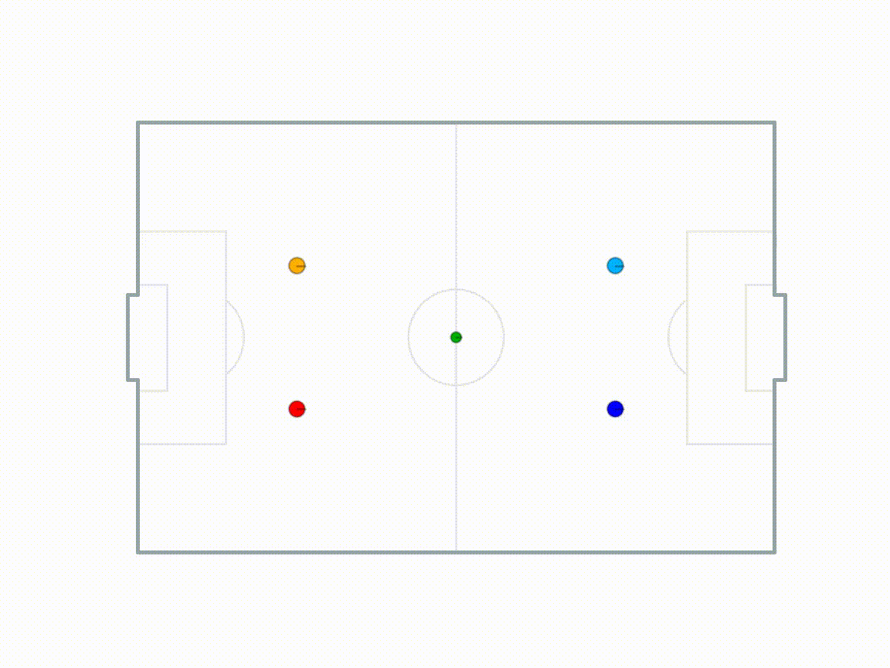
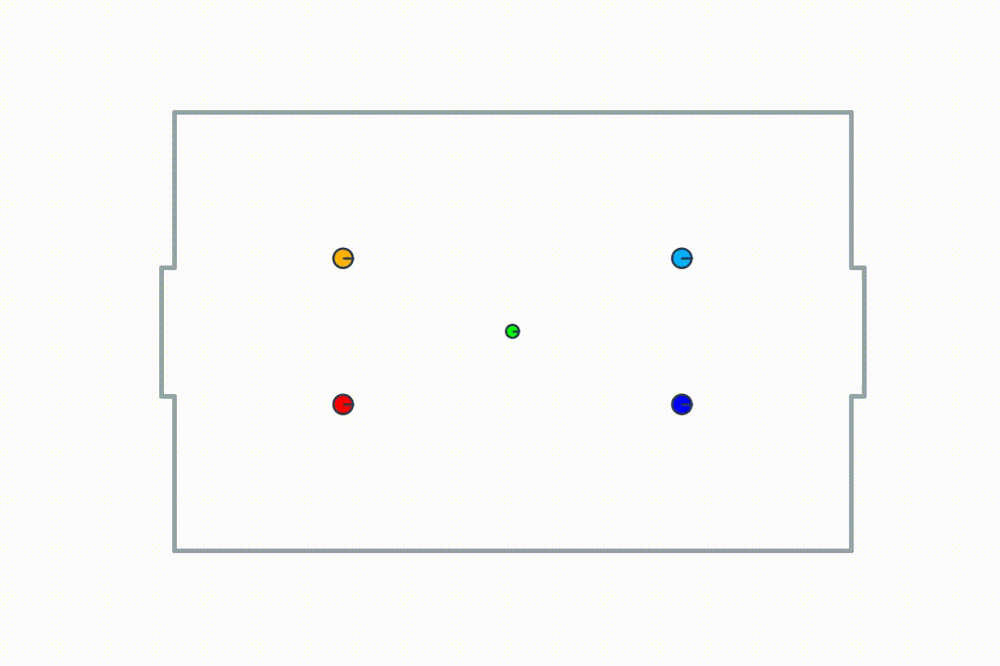
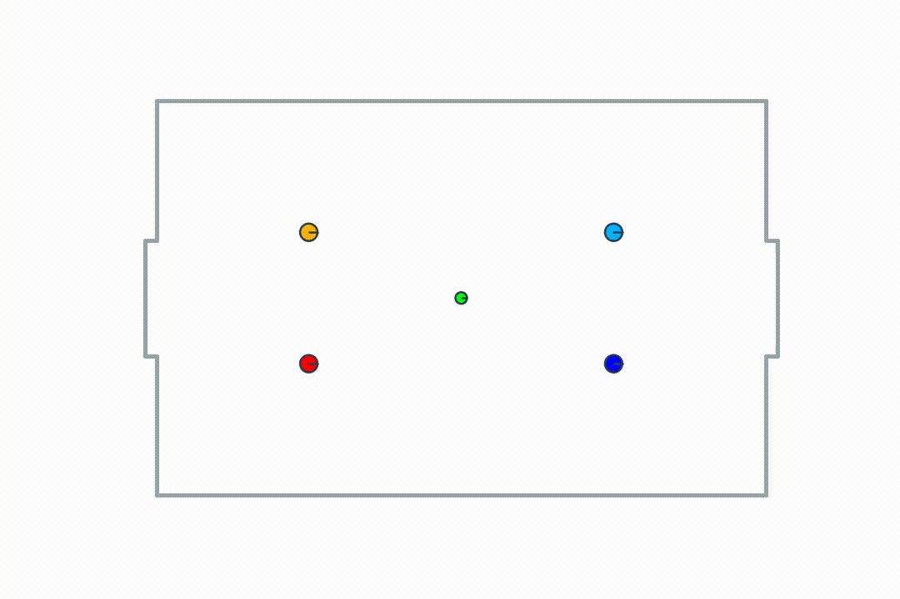

# gym_futbol_v1



This project is a 2D simulation of real world soccer.

It continues the work on gym-futbol(https://github.com/yc2454/gym-futbol).

## Quick start

To install the Python module:
```commandline
git clone https://github.com/zhengxingXue/gym_futbol_v1.git
cd gym_futbol_v1
pip install -e .
```

To try the environment with PPO2 agent (trained 1M timestep):
```commandline
python main.py
```
The simulation is recorded and showed in the pop up window. The video file is saved in ``videos/`` directory.

``tutorial.ipynb`` contains example for training, to start:
```commandline
jupyter notebook tutorial.ipynb 
```

## Env

To create the ``futbol`` environment:
```python
import gym, gym_futbol_v1
env = gym.make('futbol-v1')  # 2v2 settings
env.render()
```

## Training

To train the ``futbol`` environment with PPO2(MlpPolicy) algorithm for 100,000 time step:
```commandline
python training/ppo2_mlp_policy.py
```
The trained model and best model during the training are saved in ``training/logs/MlpPolicy-{time}`` directory.

## Examples

Recording of initialized PPO2 agent vs. random opponents:



Recording of a trained PPO2 agent (1 Million time step) vs. random opponents:

